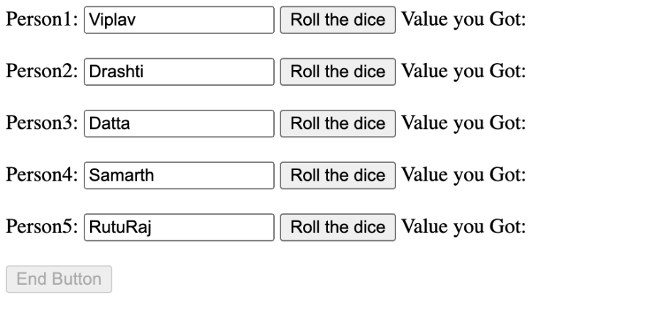

# Instructions  

## Objective: Your task is to create a simple and intuitive user interface for the dice game. There is no need for user login or signup.

 ### Specifications:

    - The interface should have a section where players can enter their names and then press a 'Submit' button to roll the dice. The dice roll should happen in the backend, and the results should be displayed next to each player's name in real-time.

    - There should be a 'Show Results' button that fetches all dice rolls from the backend and displays them on the page.

    - There should be a 'Reset Game' button that triggers the reset endpoint on the backend and clears the game on the frontend.

    - Your interface should handle potential errors from the backend gracefully and display relevant error messages to the user.

Sample Image for Design: 

)  

  